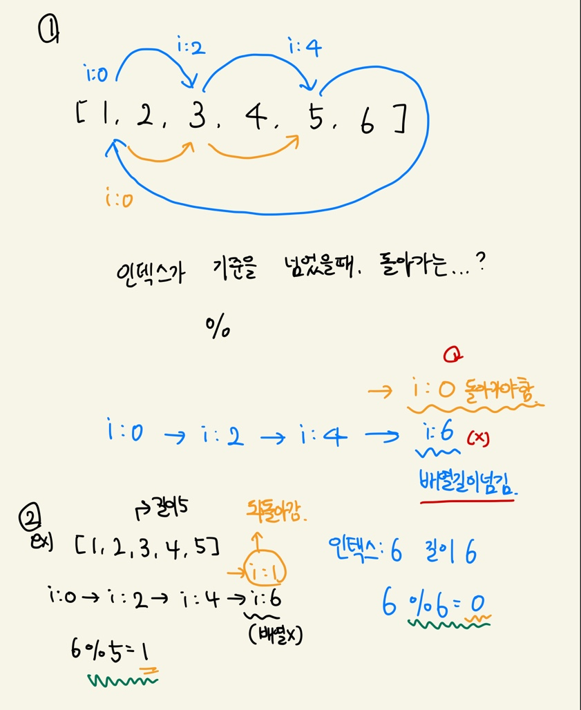

[프로그래머스-공던지기](https://school.programmers.co.kr/learn/courses/30/lessons/120843)

## :book: 문제 설명

- 머쓱이는 친구들과 동그랗게 서서 공 던지기 게임을 하고 있습니다. 공은 1번부터 던지며 오른쪽으로 한 명을 건너뛰고 그다음 사람에게만 던질 수 있습니다. 친구들의 번호가 들어있는 정수 배열 `numbers`와 정수 `K`가 주어질 때, `k`번째로 공을 던지는 사람의 번호는 무엇인지 return 하도록 solution 함수를 완성해보세요.

  

## 제한 상황

- 2 < `numbers`의 길이 < 100
- 0 < `k` < 1,000
- `numbers`의 첫 번째와 마지막 번호는 실제로 바로 옆에 있습니다.
- `numbers`는 1부터 시작하며 번호는 순서대로 올라갑니다.


## 입출력 예 

| numbers            | k    | result |
| ------------------ | ---- | ------ |
| [1, 2, 3, 4]       | 2    | 3      |
| [1, 2, 3, 4, 5, 6] | 5    | 3      |


## 풀이




### :heavy_check_mark: 내 코드

```js
/**
 * 공을 던지는데 한명씩 건너뛰면서 던지는거야.. k번째로 공던지는 사람의 번호는 무엇이니..?
 * @param {Array} numbers 친구들 번호가 들어있는 정수 배열 [1, 2, 3, 4, 5, 6]
 * @param {number} k k번째로 공을 던지는 사람 번호= k번째까지만 공을 던지면 된다 5
 * @returns k번째로 공던지는 사람의 번호를 정답으로 리턴 3
 */

function solution(numbers, k) {
  let cnt = 1;
  for (let i = 0; ; i += 2) {
    i %= numbers.length;
    const item = numbers[i];
    if (cnt === k) {
      return item;
    }
    cnt++;
  }
}


```

